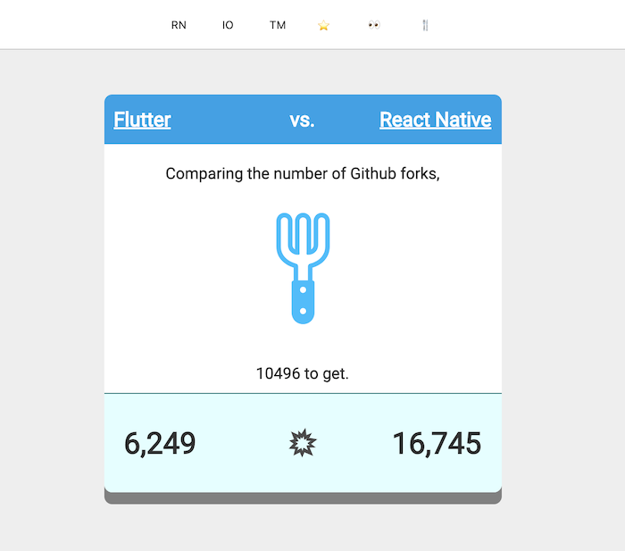

Compare the number of stargazers/forks/watchers with counterparts.  
Written in dart.



[deployed on netlify](https://fluttervs.netlify.com)

- [vs. react-native fork](https://fluttervs.netlify.com/#forks.facebook/react-native)
- [vs. titanium mobile watcher](https://fluttervs.netlify.com/#watchers.appcelerator/titanium_mobile)
- [vs. react-native strar](https://fluttervs.netlify.com/#stargazers.ionic-team/ionic)


# requirement
- Dart >= 2.1

# installation

```bash
pub get
```

If you want more info, [see here.](https://webdev.dartlang.org/)


# build

in development
```bash
$ pub run build_runner serve
```

release build
```bash
$ pub run build_runner build --release --output web:public
```

# todo
- switch link
- refresh button
- more FWs